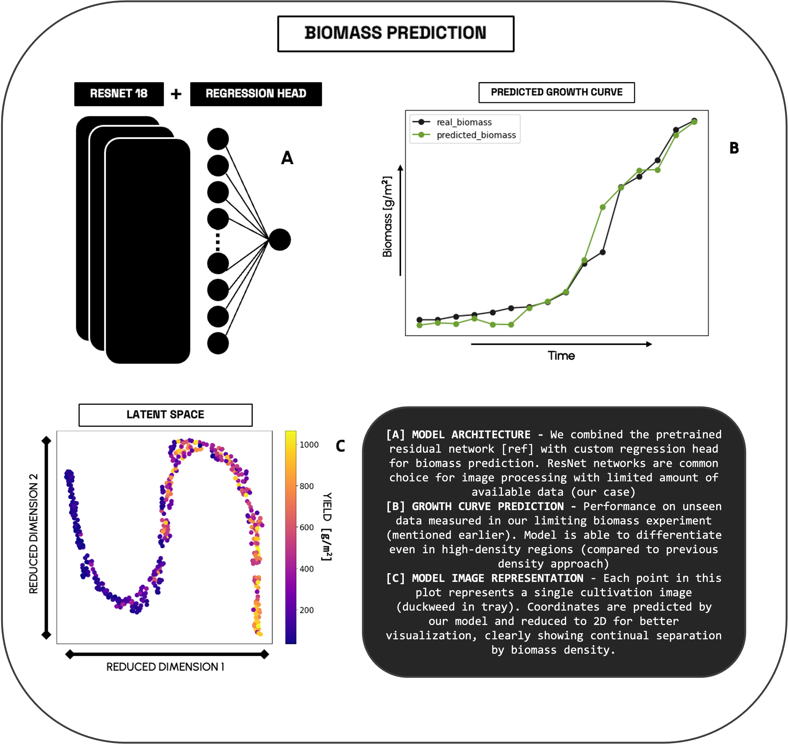
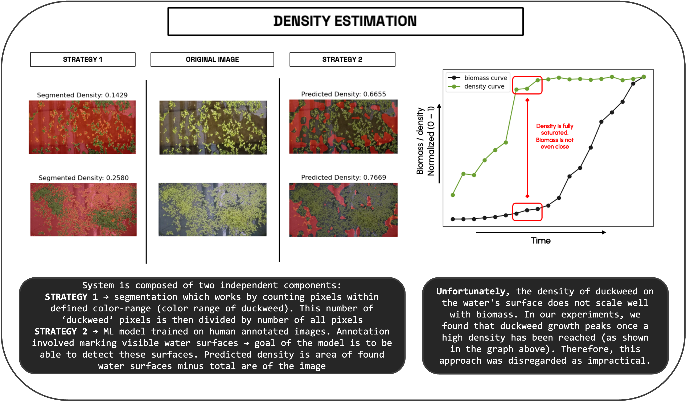

# DUCKEYE 🌱

**DUCKEYE** is a powerful monitoring toolbox for duckweed cultivation, developed by the [iGEM BRNO team](https://teams.igem.org/5642) for the [iGEM competition](https://competition.igem.org). Designed for simplicity and scalability, DUCKEYE enables researchers and cultivators to monitor duckweed growth using minimal hardware—just a decent camera and a basic processing unit like a laptop. For cultivation design tools, check out our companion project, [DUCKTOOLS](https://github.com/karatedava/DUCKTOOLS).

<p align="center">
  
</p>

---

## Table of Contents

- [Overview](#overview)
- [How It Works](#how-it-works)
- [Installation](#installation)
  - [Option 1: Local Installation with Miniconda](#option-1-local-installation-with-miniconda)
  - [Option 2: Web Application](#option-2-web-application)
- [How to Run](#how-to-run)
  - [Command Parameters](#command-parameters)
- [Detailed Schemes](#detailed-schemes)
  - [Biomass Regressor](#biomass-regressor)
  - [Density Estimator](#density-estimator)
- [Hardware Setup](#hardware-setup)
- [License](#license)

---

## Overview

DUCKEYE is a versatile toolbox tailored for monitoring duckweed cultivation. It leverages machine learning to analyze images of duckweed, providing insights into water coverage and biomass prediction. The system is lightweight, requiring only a camera capable of sending images to a processing unit (e.g., a small laptop). For detailed hardware requirements, see the [Hardware Setup](#hardware-setup) section.

---

## How It Works

DUCKEYE processes images of duckweed cultivation setups to estimate key parameters like water coverage and biomass. Using machine learning models, it analyzes raw images and generates detailed outputs stored in the `outputs` directory. The toolbox supports both local execution and a user-friendly web application, making it accessible for testing on mobile devices with cameras.

---

## Installation

### Option 1: Local Installation with Miniconda

To set up DUCKEYE locally, follow these steps:

1. **Install Miniconda**  
   Download and install Miniconda by following the [official Miniconda installation guide](https://docs.conda.io/en/latest/miniconda.html).

2. **Create a New Conda Environment**  
   Create a Python 3.12 environment and activate it:
   ```bash
   conda create -n duckeye python=3.12
   conda activate duckeye
   ```

3. **Install Dependencies**  
   Navigate to the project directory and install the required packages:
   ```bash
   pip install -r requirements.txt
   ```

### Option 2: Web Application

No installation required! Try DUCKEYE's full functionality through our web application, featuring a user-friendly interface optimized for mobile devices with cameras.  
👉 **Access the web app**: [Web App Link Here] (PLACEHOLDER).

---

## How to Run

1. **Prepare Your Images**  
   Create a new folder inside `data/raw_images` (e.g., `data/raw_images/your_folder_name`) and upload your raw duckweed photos. An `examples` folder is included as a reference.

2. **Run the Analysis**  
   In the terminal, navigate to the project directory and execute:
   ```bash
   python ducksee.py --name run_id --input your_folder_name
   ```

3. **View Results**  
   Inspect the generated outputs in the `outputs` directory, labeled with your specified `run_id`.

### Command Parameters

Customize your analysis with the following parameters:

| Parameter   | Description                                                                 | Options/Default                     |
|-------------|-----------------------------------------------------------------------------|-------------------------------------|
| `--name`    | Signature of the run (used to label output data)                            | User-defined string                 |
| `--input`   | Name of the folder in `data/raw_images` containing raw images               | Folder name (e.g., `your_folder_name`) |
| `--device`  | Hardware for computation                                                   | `CPU` (default), `CUDA` (NVIDIA GPU), `MPS` (Mac) |
| `--eyes`    | Machine learning model to use                                              | `ALL` (default), `WC` (water coverage), `BP` (biomass prediction) |

Example command with all parameters:
```bash
python ducksee.py --name experiment1 --input my_images --device CUDA --eyes WC
```

---

## Detailed Schemes

### Biomass Regressor
The biomass regressor estimates duckweed biomass from images.  
<p align="center">
  
</p>

### Density Estimator
The density estimator analyzes water coverage in duckweed cultivation.  
<p align="center">
  
</p>

---

## Hardware Setup

DUCKEYE requires minimal hardware:
- **Camera**: Any camera capable of capturing images and transferring them to a processing unit (e.g., via USB, Wi-Fi, or cloud storage).
- **Processing Unit**: A small laptop or equivalent with at least 4GB RAM and a modern CPU. For faster processing, a CUDA-compatible NVIDIA GPU or Apple Silicon (MPS) is supported but not required.

For detailed hardware recommendations, refer to the [iGEM BRNO team cultivator page](https://teams.igem.org/5642).

---

## License

This project is licensed under the MIT License. See the [LICENSE](LICENSE) file for details.